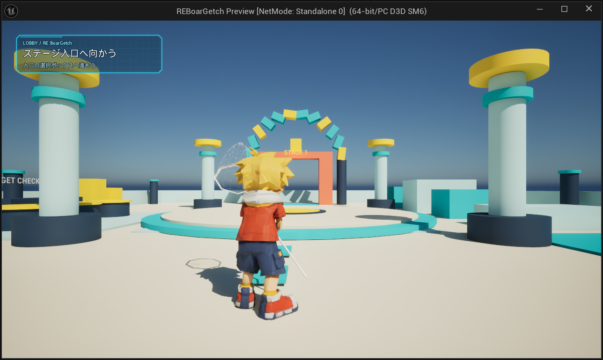

# ロビーHUD Prototype

- 新規 `/Game/BP/Widget/WBP_LobbyHUD`。既存 `BoarHUDWidget` を継承し、`BP_PC_Lobby.PlayerHUDWidgetClass` に接続。既存Controllerの生成・破棄経路を使用。C++・入力・既存グラフは無変更。
- SafeZone → Canvas → 小型目的パネル。計7部品。左上に「ステージ入口へ向かう」を表示。非Focusableでゲーム入力を遮らない構成。
- 既存 `M_UI_HoloHUD_Prototype` を再利用。新規 `MI_UI_HoloLobby_Objective_Prototype` は480×136、Fill=0.48。既存Robotoを再利用。
- Widget／Controller Compile、3資産Save成功。再取得で親Class、7部品、Controller接続を確認。
- `/Game/Maps/L_Lobby` は実際には `/Game/Level/L_Lobby` へ解決。既存GameModeが `BP_GM_Lobby` であることを確認。Levelは編集・保存していない。
- PIEでHUD初期表示、日本語の可読性、透明面、中央視界を確認。PIE終了済み。実機Gamepad・他解像度の検証は未実施。
- 今回は常時目的表示のみ。入口接近時の展開、ステージ選択画面、動的目的更新は未実装。既存StageEntranceのLobbyWidgetClassは未設定のまま。これらを今回の完成範囲に含めない。

