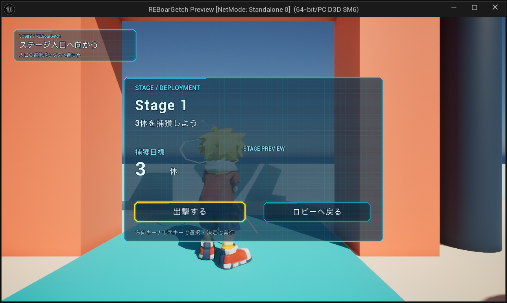

# ステージ選択UI Prototype — 2026-09-22

最新の2026-09-24カルーセル変更は [UI_FlowGlow_Carousel.md](UI_FlowGlow_Carousel.md) を参照。以下は過去の実装・検証記録。

Notion: https://app.notion.com/p/3dfb6c88752581bf8e85e4c65fca9b37

## 実装範囲

- `/Game/BP/Widget/WBP_LobbyStageSelect` を新規作成。親は既存 `UBoarLobbyWidget`、19 Widgets。SafeZone → Canvas → 中央1000×640の半透明パネル。
- ステージ名・説明・捕獲目標・任意サムネイル・出撃・キャンセル。名前指定で既存C++の更新／クリック処理に接続。C++ソース変更なし。
- `/Game/BP/Widget/WBP_HoloActionFrame` を新規作成。NamedSlot内の実ボタンを親WidgetTreeに保持し、FocusPathでアンバー枠＋1.035倍拡大を表示。既存WBP_HoloMenuEntryとそのMaterialを再利用し、既存共通Widgetは変更していない。
- 新規 `/Game/UI/Prototype/MI_UI_HoloStageSelect_Panel_Prototype` は既存ホログラムMasterを継承。Width1000、Height640、Fill0.72。
- Constructの次TickにUIOnlyと出撃ボタンへのフォーカスを設定。マウスHoverもKeyboardFocusに接続。閉じる際のGameOnly復帰は既存StageEntrance処理。
- `/Game/BP/Lobby/BP_StageEntrance_Stage01` のlobbyWidgetClassを設定。Lobbyの仮Triggerと同位置(1210,0,130)に不可視の既存入口クラスを追加、範囲150×220×130。既存Trigger、3D造形、アセット名は保持。

## 検証

- Compile: WBP_LobbyStageSelect、WBP_HoloActionFrame、BP_StageEntrance_Stage01成功。
- Save成功。再取得でWidget数、6つの名前参照、配置入口のConfig/Class参照を確認。
- PIE: ロビーでテスト用にプレイヤーを入口外から内へ移動し、実Overlap経由で表示。
- DA_TestStageConfigのStage 1／3体を捕獲しよう／捕獲目標3を表示。
- 初期出撃Focus、アンバー太枠と拡大を画像確認。
- MCPのGamepad_DPad_Rightでキャンセルへ移動、Gamepad_FaceButton_Bottomで画面を閉じることを確認。
- 入口外→内で再表示、Enterで実際に `/Game/Level/Test` へ遷移。HUDのHP5/5、捕獲0/3を確認。
- PIE停止済み。物理ゲームパッドでの実機確認は未実施。

## 未実装・必要素材

- ConfigのthumbnailはNone。推測素材は設定せず、Imageは既存処理でCollapsed。割当後の画像表示は未検証。
- 今回は単一ステージ。Notionの複数ステージ切替、ロック状態、クリア状況、コイン／図鑑進捗、3Dミニチュアは次段階。
- キャンセルは画面の「ロビーへ戻る」を選択して決定。B/Escapeの直接キャンセルは追加していない。
- 初回検証で入口内に直接PIEスポーンするとUIは出なかった。通常の入口外からの侵入と再侵入を検証済み。

## ステージ一覧拡張 — 2026-09-23

この節は上記の単一ステージ版を更新する。今回のUE実行テスト／PIEはユーザー担当のため実施していない。

- 既存WBP_LobbyStageSelectを保持して34 Widgetsへ拡張。左側に340×760のホログラム一覧、右側に既存1000×760の詳細・出発・戻る・図鑑を配置。
- 新規WBP_StageSelectEntryは既存BoarLoadoutEntryを継承。共通HoloActionFrame、既存Font／Materialを再利用し、選択アンバー枠、Focus拡大、ロック図形を追加。
- StageEntranceのStageCatalogから一覧を生成。未解放は暗く表示し、選択・出発不可。CLEAR、特別コイン数、図鑑進捗は既存Saveデータから表示。
- 初期選択は前回出発した解放済みStageを優先し、なければ既存StageConfig、次に最初の解放済みStageへフォールバック。
- 左右キー／D-pad左右／LB・RBで解放済みStageを循環。B／Escapeで戻る。行の決定または出発ボタンで出発。IMCの追加設定は不要。
- 出発時に解放状態を再確認し、LastAttemptedStageIdを保存。保存失敗時は遷移せずエラーを表示。
- BP_StageEntrance_Stage01のStageCatalogには既存DA_TestStageConfigのみ登録。複数Stageの確認には固有StageId／遷移先を持つ実際のStageConfigを同配列へ追加する。架空のStageや個体データは作成していない。
- 個体データ未登録時は図鑑に「個体データ未登録」と表示。3Dミニチュアは未実装、既存の任意サムネイル処理を保持。

検証：Development Editor C++ビルド成功。WBP_StageSelectEntry、WBP_LobbyStageSelect、WBP_LoadoutEntry、WBP_GadgetLoadout、WBP_BoarEncyclopedia、BP_StageEntrance_Stage01を警告もエラー扱いでCompile成功。対象Assetを保存し、未保存フラグfalse、Widget構造、名前参照、入力キー、StageCatalogを再取得で確認。実行時の描画・操作・複数Stage切替は未検証。
